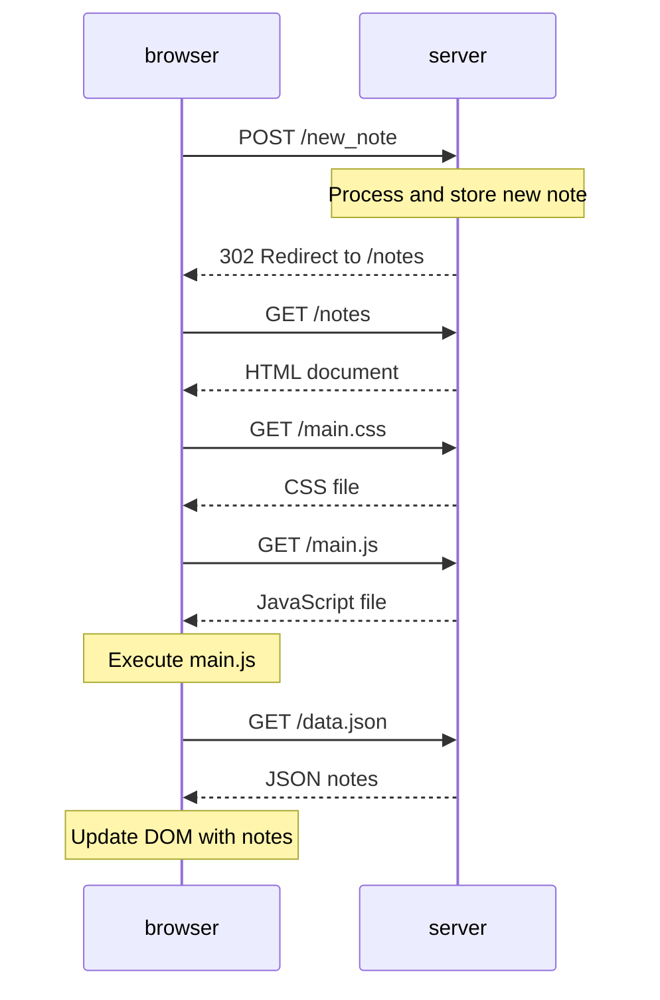

```mermaid
sequenceDiagram
    participant browser
    participant server
    
    browser->>server: POST /new_note
    Note over server: Process and store new note
    server-->>browser: 302 Redirect to /notes
    
    browser->>server: GET /notes
    server-->>browser: HTML document
    
    browser->>server: GET /main.css
    server-->>browser: CSS file
    
    browser->>server: GET /main.js
    server-->>browser: JavaScript file
    
    Note over browser: Execute main.js
    
    browser->>server: GET /data.json
    server-->>browser: JSON notes
    
    Note over browser: Update DOM with notes 
```
