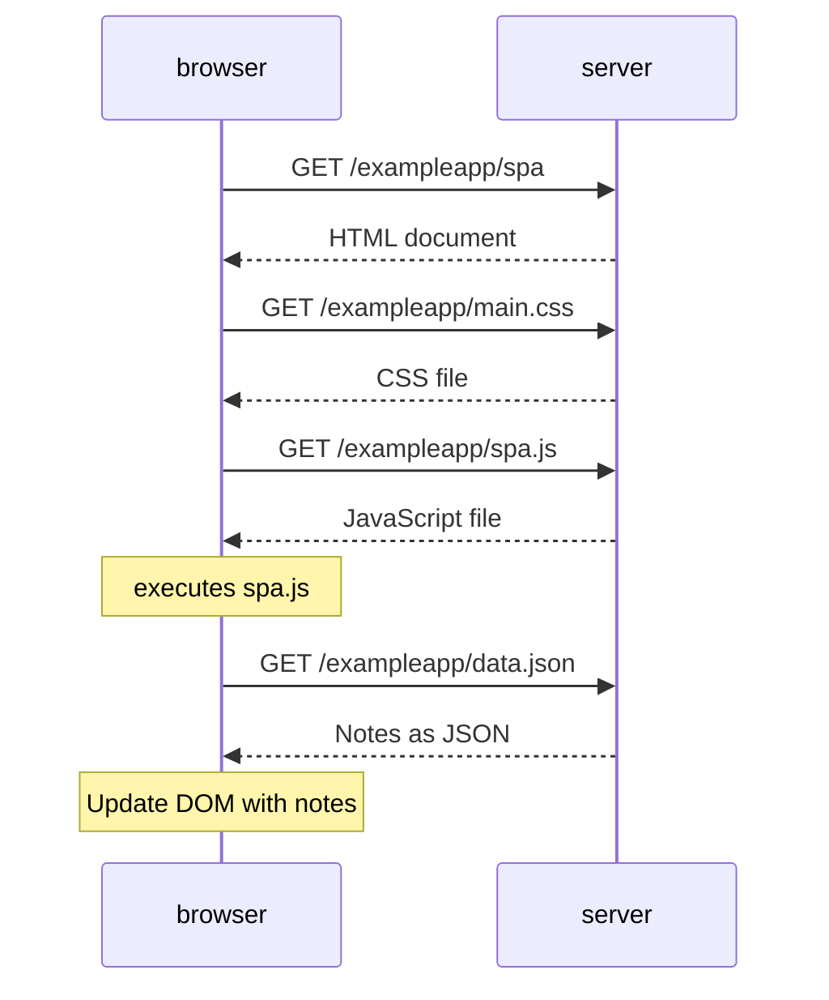

```mermaid
sequenceDiagram
    participant browser
    participant server
    
    browser->>server: GET /exampleapp/spa
    server-->>browser: HTML document
    
    browser->>server: GET /exampleapp/main.css
    server-->>browser: CSS file
    
    browser->>server: GET /exampleapp/spa.js
    server-->>browser: JavaScript file

    Note over browser: executes spa.js
    
    browser->>server: GET /exampleapp/data.json
    server-->>browser: Notes as JSON

    Note over browser: Update DOM with notes 
```
